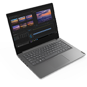

# Lenovo V14-IIL 82C4
   
# Important information:
This project is in "beta", this means that this project isn't complete/working fully. EFI built for Sequoia with Intel wifi support.

Note: I recommend switching out the nVme drive for a different one (Factory installed SSD isn't supported by Opencore) or installing it on a SSD. 
- Also for Intel Wi-Fi/Bluetooth to work it its required to install from OCLP Root Patches. 
- If you have an outdated BIOS, please upgrade it to the latest version available (Currently available version for this device is: DKCN55WW)

| Specifications | Details |
|:-: |:-: |
| Processor | Intel Core i5-1035G1  |
| Memory | 8GB DDR4 2600MHz |
| SSD | SAMSUNG MZALQ256HAJD-000L2 (256GB) |
| Graphics Card | Intel® UHD Graphics (ICL GT1)|
| Display | 14 inch 1920x1080 |
| Sound Card | Realtek ALC236 |
| Network Card | Dual Band AC 9462|

## Current status:
##### Working:
- Sound / Mic 
- Keyboard
- USBs
- Brightness adjustment
- Battery managment
- Power managment
- Sleep / Wake

##### Partialy working:
- Intel Graphics (HDMI not tested)
- Touchpad(It is detected as a mouse, not touchpad.)

##### Not working:
- - Bluetooth / Wifi (Uses BroadCom card, I recommend switching out for Intel card. )

##### Not tested:
- Camera
- Card reader
## DISCLAIMER:
1. This project started for educational purposes. 
2. The data, guides etc of this project are provided as they are. 
3. I take no responsibility for any problem or damage of your system.

## Credits
- [Acidanthera](https://github.com/acidanthera)
- [Dortania's OC guide](https://dortania.github.io/OpenCore-Install-Guide/)
- [Rehabman's ACPI hotpatching guide](https://www.tonymacx86.com/threads/guide-using-clover-to-hotpatch-acpi.200137/)
- [OpenWireless project](https://github.com/OpenIntelWireless/itlwm)
- [Daliansky's OC-little repo](https://github.com/daliansky/OC-little)
- [alexandred/VoodooI2C Gitter](https://gitter.im/alexandred/VoodooI2C)